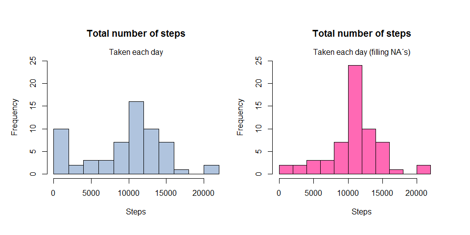

---

## Loading and preprocessing the data
Load the libraries needed:

```r
library(dplyr)
```

```
## 
## Attaching package: 'dplyr'
```

```
## The following objects are masked from 'package:stats':
## 
##     filter, lag
```

```
## The following objects are masked from 'package:base':
## 
##     intersect, setdiff, setequal, union
```

```r
library(ggplot2)
```


### 1. Load the data:

Download the Data Set if it's not found in the working directory and save it in "activity".

```r
fileURL <-
        "https://d396qusza40orc.cloudfront.net/repdata%2Fdata%2Factivity.zip"

## Download File to working directory:
if (!file.exists("./activity.csv")) {
        download.file(fileURL, destfile = "repdata_data_activity.zip")
        unzip("./repdata_data_activity.zip")
}

## Load data:
activity <- read.csv("activity.csv")
```


### 2. Process/transform the data (if necessary) into a format suitable for your analysis
Change "date"" variable to date format:

```r
activity$date <- as.Date(activity$date, "%Y-%m-%d")
```


## What is mean total number of steps taken per day?
For this part of the assignment, you can ignore the missing values in the dataset.

### 1. Calculate the total number of steps taken per day:

```r
DailySummary <-
        activity %>% group_by(date) %>% summarise(Total.Steps = sum(steps, na.rm = TRUE))
```


### 2. If you do not understand the difference between a histogram and a barplot, research the difference between them. Make a histogram of the total number of steps taken each day.


```r
hist(DailySummary$Total.Steps, main = "Total number of steps taken each day", xlab = "Steps", breaks = 10, ylim = c(0,25), col = "lightsteelblue" )
```

<!-- -->

### 3. Calculate and report the mean and median of the total number of steps taken per day:
The mean:

```r
mean(DailySummary$Total.Steps)
```

```
## [1] 9354.23
```
The median:

```r
median(DailySummary$Total.Steps)
```

```
## [1] 10395
```


## What is the average daily activity pattern?
### 1. Make a time series plot of the 5-minute interval (x-axis) and the average number of steps taken, averaged across all days (y-axis):

Calculate average steps by interval:

```r
avgSteps <- aggregate(steps ~ interval, data = activity, FUN = mean)
```
Make the time series plot:

```r
plot(
        x = avgSteps$interval,
        y = avgSteps$steps,
        type = "l",
        main = "Average number of steps taken per interval (Across all days)",
        ylab = "Steps",
        xlab = "Interval"
)
```

<!-- -->

### 2. Which 5-minute interval, on average across all the days in the dataset, contains the maximum number of steps?
The interval with the maximum number of steps:

```r
avgSteps[which.max(avgSteps$steps), 1]
```

```
## [1] 835
```
*IMPORTANT: The previous chunk of code Shows the number of the interval*


## Imputing missing values
Note that there are a number of days/intervals where there are missing values (coded as NA). The presence of missing days may introduce bias into some calculations or summaries of the data.

### 1. Calculate and report the total number of missing values in the dataset (i.e. the total number of rows with NAs)


```r
sum(is.na(activity$steps))
```

```
## [1] 2304
```

### 2. Devise a strategy for filling in all of the missing values in the dataset. The strategy does not need to be sophisticated. For example, you could use the mean/median for that day, or the mean for that 5-minute interval, etc.
The missing values (NA큦) in the *steps* variable, for the data set will be filled using the mean for that 5-minute interval.

### 3. Create a new dataset that is equal to the original dataset but with the missing data filled in.

```r
activityFill <- activity
activityFill <-
        transform(activityFill,
                  steps = ifelse(is.na(activity$steps), yes = avgSteps[match(activityFill$interval, avgSteps$interval), 2], no = activity$steps))
```
The data set **before** filling NA's:

```r
head(activity, 4)
```

```
##   steps       date interval
## 1    NA 2012-10-01        0
## 2    NA 2012-10-01        5
## 3    NA 2012-10-01       10
## 4    NA 2012-10-01       15
```
The data set **after** filling NA큦:

```r
head(activityFill, 4)
```

```
##       steps       date interval
## 1 1.7169811 2012-10-01        0
## 2 0.3396226 2012-10-01        5
## 3 0.1320755 2012-10-01       10
## 4 0.1509434 2012-10-01       15
```


### 4. Make a histogram of the total number of steps taken each day and Calculate and report the mean and median total number of steps taken per day. 

```r
DailySummaryFill <-
        activityFill %>% group_by(date) %>% summarise(Total.Steps = sum(steps))
hist(
        DailySummaryFill$Total.Steps,
        breaks = 10,
        main = "Total number of steps taken each day",
        xlab = "Steps",
        sub = "With filled missing values",
        ylim = c(0,25),
        col = "hotpink"
)
```

<!-- -->


The mean total number of steps taken per day.

```r
mean(DailySummaryFill$Total.Steps)
```

```
## [1] 10766.19
```
The median total number of steps taken per day.

```r
median(DailySummaryFill$Total.Steps)
```

```
## [1] 10766.19
```
### Do these values differ from the estimates from the first part of the assignment? 
*Yes, clearly, filling in missing values affect the total mean and median values, increasing from 9354.23 to 10766.19 for the mean and from 10395 to 10766.19 for the median* 


### What is the impact of imputing missing data on the estimates of the total daily number of steps?

```r
par(mfrow = c(1,2), mar = c(4,4,5,1), oma = c(2,1,1,1))
hist(
        DailySummary$Total.Steps, 
        main = "Total number of steps", 
        xlab = "Steps", 
        breaks = 10, 
        ylim = c(0,25),
        col = "lightsteelblue")
mtext("Taken each day")
hist(
        DailySummaryFill$Total.Steps,
        breaks = 10,
        main = "Total number of steps",
        xlab = "Steps",
        ylim = c(0,25),
        xlim = c(0,24000),
        col = "hotpink"
)
mtext("Taken each day (filling NA큦)")
```


*Clearly filling NA큦 reduces the frequency count for steps 0-2000 and increases the frequency count for steps 10000-12000*


## Are there differences in activity patterns between weekdays and weekends?
For this part the weekdays() function may be of some help here. Use the dataset with the filled-in missing values for this part.

### 1. Create a new factor variable in the dataset with two levels - "weekday" and "weekend" indicating whether a given date is a weekday or weekend day.

```r
activityFill <-
        activityFill %>% mutate(day.type = factor(ifelse(
                weekdays(activityFill$date) %in% c("Saturday", "Sunday"),
                yes = "weekend",
                no = "weekday"
        )))
```
Visualizing the Data Set:

```r
head(activityFill, 4)
```

```
##       steps       date interval day.type
## 1 1.7169811 2012-10-01        0  weekday
## 2 0.3396226 2012-10-01        5  weekday
## 3 0.1320755 2012-10-01       10  weekday
## 4 0.1509434 2012-10-01       15  weekday
```


### 2. Make a panel plot containing a time series plot (i.e. type="l") of the 5-minute interval (x-axis) and the average number of steps taken, averaged across all weekday days or weekend days (y-axis). See the README file in the GitHub repository to see an example of what this plot should look like using simulated data.

Create a new Data Set containing the average number of steps taken, averaged across all weekday days or weekend days, for each of the 5-minute intervals:

```r
avgStepsFill <-
        aggregate(steps ~ interval + day.type, data = activityFill, FUN = mean)
```
Make panel plot:

```r
g <-
        ggplot(avgStepsFill, aes(x = interval, y = steps, col = day.type))
g + geom_line() + facet_grid(day.type ~ .)
```

<!-- -->

